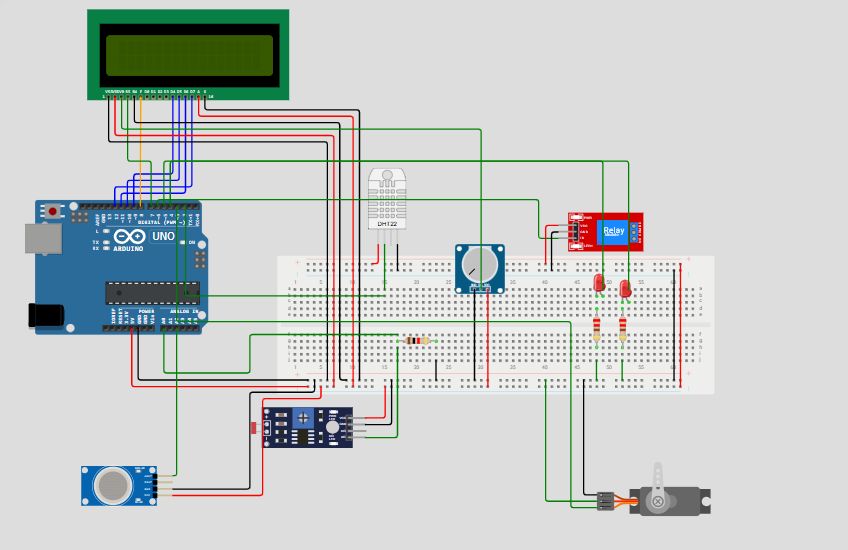

# Actividad 2. Sistema de control y actuación en función del clima.
## Autores: Adrián Antolín Pellicer, Pablo Nicolás Cristóbal Navas, Ahinoa Santamaría Puras
### Equipos e Instrumentación Electrónica, UNIR. Grupo 6

# Introducción
Este proyecto se centra en la mejora y optimización de una estación meteorológica previamente desarrollada, adaptándola para su uso en una boya destinada a la monitorización del entorno climático. Partiendo del diseño realizado en la práctica 1, se han añadido nuevas funcionalidades con el objetivo de ampliar su operatividad y mejorar su desempeño. Para ello, se seleccionaron e integraron las mejores ideas propuestas individualmente por los miembros del grupo en la actividad anterior, combinándolas con otras mejoras sugeridas en esta nueva fase del trabajo.

Entre las novedades incorporadas se encuentran un servomotor que permite regular la temperatura del sistema ante condiciones de calor extremo y un relé encargado de activar un sistema calefactor cuando la temperatura ambiente desciende. También se añadieron dos luces LED que se encienden automáticamente en función de la iluminación, facilitando la visibilidad de la boya en entornos con poca luz. Toda la información recogida por los sensores es gestionada por un microcontrolador, que se encarga de procesar los datos y mostrarlos en una pantalla LCD, permitiendo así una visualización clara y en tiempo real del estado del entorno.

El desarrollo de este proyecto ha brindado la oportunidad de aplicar de forma práctica los conocimientos adquiridos durante el curso, en especial los relacionados con microcontroladores, sensores y montaje de sistemas electrónicos. Asimismo, ha contribuido al fortalecimiento de competencias clave en el diseño e implementación de soluciones tecnológicas orientadas al análisis ambiental, con aplicaciones futuras en el ámbito de las telecomunicaciones y la ingeniería aplicada.

# Ejemplo 1
No ha sido posible implementar este ejemplo debido a que no disponíamos de el componente CI L293D, necesario para controlar el motor DC, ni en wokwi ni en el kit físico que recibimos. 

# Ejemplo 2 - Servomotor
Como podemos ver en el programa haciendo clic en el siguiente enlace [wokwi](https://wokwi.com/projects/432313638470879233), se ha realizado la implementación de un servofreno conectandolo a tierra, 5V y a un pin PWM.
El sistema está programado para que realice giros en el aspa instalado de 0 a 180 grados para pasado un tiempo determinado hacer el gito inverso, es decir de 180 a 0 grados.

# Ejemplo 3 - Motor paso a paso
Como podemos ver en la implementacion realizada en [wokwi](https://wokwi.com/projects/432314677733555201), se ha realizado la implementación de un motor de paso a paso conectadno las entradas a los pines 8,9,10 y 11.
Para la lógica empleada en el programa, se ha definido el número de pasos que debe realizar el motor en este caso 200, que lo realiza en una dirección durante un tiempo determinado y en la dirección opuesta durante ese mismo periodo.


# Ejemplo 4
[wokwi](https://wokwi.com/projects/431938639801559041)

# Ejemplo 5
[wokwi](https://wokwi.com/projects/432310955268316161)

# Ejemplo 6
[wokwi](https://wokwi.com/projects/432136645298838529)

# Sistema final de control y actuación en función del clima.


Para nuestro [sistema final](https://wokwi.com/projects/432309953936838657), vamos a tener algunos de los sensores de la actividad 1. Son los siguientes:
- DHT22: mide temperatura y humedad.
- LDR: mide la luminosidad.
- MQ2 gas sensor: mide la calidad del aire

A mayores tenemos un potenciómetro que sirve para variar la luminosidad de la pantalla LCD y hemos definido en código que se actualicen los resultados cada dos minutos realizando un promedio.
```
// Calcular promedio cada 8 lecturas
  static unsigned long lastAverageTime = 0;
  // en loop()
  if (millis() - lastDHTRead >= DHT_INTERVAL) {
    lastDHTRead = millis();

    tempDHT = dht.readTemperature();

    if (!isnan(tempDHT)) {
      dhtTemps[dhtIndex] = tempDHT;
      dhtIndex = (dhtIndex + 1) % 8;

      if (dhtCount < 8) { //va hasta 8 porque si hay mediciones cada 15 segundos, hasta 2 minutos hay 8 mediciones
        dhtCount++;
      }

      // Calcular promedio cada 8 lecturas (2 minutos)
      if (dhtCount == 8) {
        float sum = 0;
        for (int i = 0; i < 8; i++) {
          sum += dhtTemps[i];
        }
        float promedio = sum / 8;

        //... muestra por pantalla
      }
    }
  } 
```

Hemos añadido diferentes actuadores en función de las lecturas de los sensores:
- Servomotor: cuando la temperatura medida es mayor a 30ºC, se pone en funcionamiento. La idea sería que se moviera 180º para abrirse y así dejar pasar agua al interior, de forma que se refrigerase el sistema.
- Relé: cuando la temperatura medida es menor a 15ºC, se activa dejando pasar corriente. Esta corriente iría hacia una resistencia de forma que aportaría calor al sistema y nos ayudaría a mantener una temperatura estable.
- LEDs: es un indicativo de la ubicación de la boya. Se activa cuando detectamos un porcentaje de luminosidad inferior al 50%.
