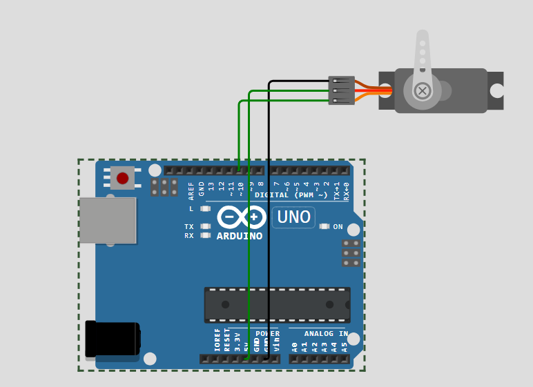
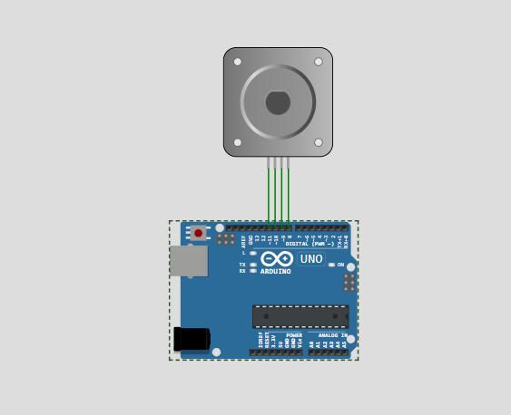
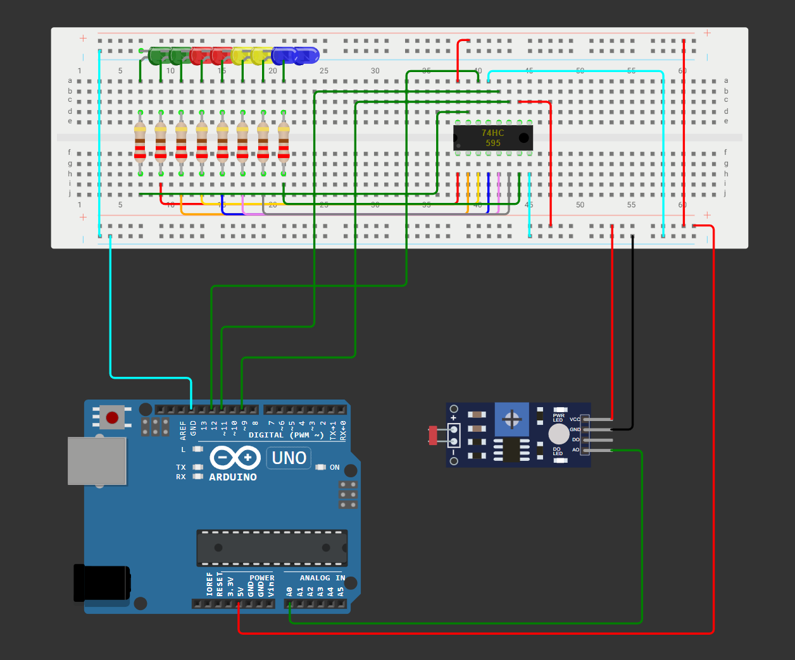
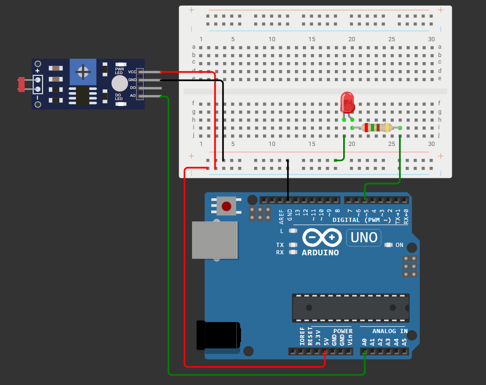
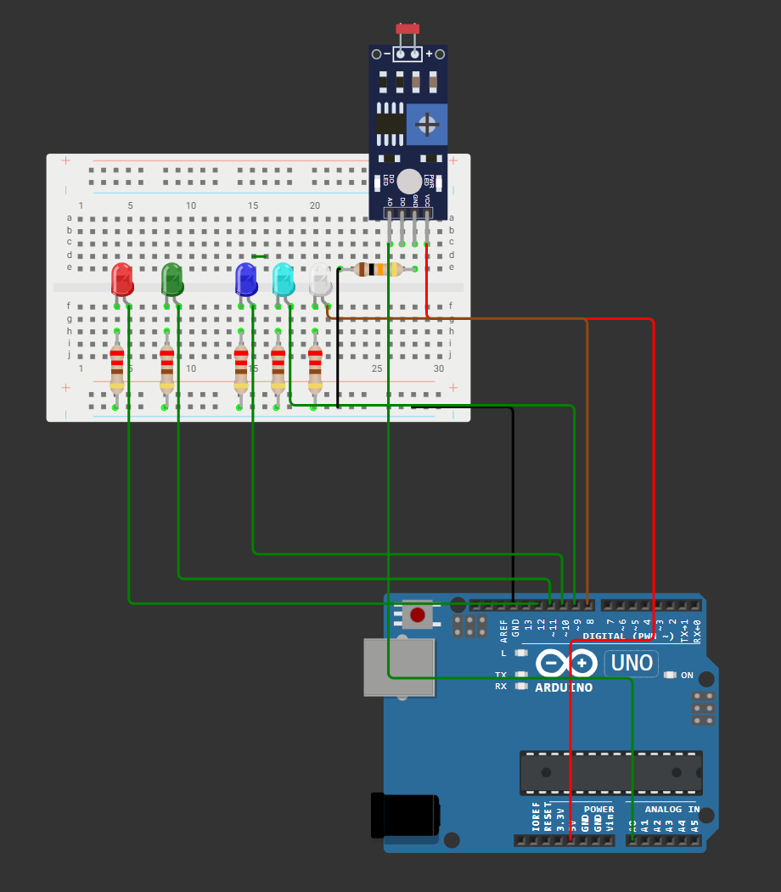

# Actividad 2. Sistema de control y actuación en función del clima.
## Autores: Adrián Antolín Pellicer, Pablo Nicolás Cristóbal Navas, Ahinoa Santamaría Puras
### Equipos e Instrumentación Electrónica, UNIR. Grupo 6

# Introducción
Este proyecto se centra en la mejora y optimización de una estación meteorológica previamente desarrollada, adaptándola para su uso en una boya destinada a la monitorización del entorno climático. Partiendo del diseño realizado en la práctica 1, se han añadido nuevas funcionalidades con el objetivo de ampliar su operatividad y mejorar su desempeño. Para ello, se seleccionaron e integraron las mejores ideas propuestas individualmente por los miembros del grupo en la actividad anterior, combinándolas con otras mejoras sugeridas en esta nueva fase del trabajo.

Entre las novedades incorporadas se encuentran un servomotor que permite regular la temperatura del sistema ante condiciones de calor extremo y un relé encargado de activar un sistema calefactor cuando la temperatura ambiente desciende. También se añadieron dos luces LED que se encienden automáticamente en función de la iluminación, facilitando la visibilidad de la boya en entornos con poca luz. Toda la información recogida por los sensores es gestionada por un microcontrolador, que se encarga de procesar los datos y mostrarlos en una pantalla LCD, permitiendo así una visualización clara y en tiempo real del estado del entorno.

El desarrollo de este proyecto ha brindado la oportunidad de aplicar de forma práctica los conocimientos adquiridos durante el curso, en especial los relacionados con microcontroladores, sensores y montaje de sistemas electrónicos. Asimismo, ha contribuido al fortalecimiento de competencias clave en el diseño e implementación de soluciones tecnológicas orientadas al análisis ambiental, con aplicaciones futuras en el ámbito de las telecomunicaciones y la ingeniería aplicada.

# Ejemplo 1
No ha sido posible implementar este ejemplo debido a que no disponíamos de el componente CI L293D, necesario para controlar el motor DC, ni en wokwi ni en el kit físico que recibimos. 

# Ejemplo 2 - Servomotor
Como podemos ver en el programa haciendo clic en el siguiente enlace [wokwi](https://wokwi.com/projects/432313638470879233), se ha realizado la implementación de un servofreno conectandolo a tierra, 5V y a un pin PWM.  
El sistema está programado para que realice giros en el aspa instalado de 0 a 180 grados para pasado un tiempo determinado hacer el gito inverso, es decir de 180 a 0 grados.  

# Ejemplo 3 - Motor paso a paso
Como podemos ver en la implementacion realizada en [wokwi](https://wokwi.com/projects/432314677733555201), se ha realizado la implementación de un motor de paso a paso conectadno las entradas a los pines 8,9,10 y 11.  
Para la lógica empleada en el programa, se ha definido el número de pasos que debe realizar el motor en este caso 200, que lo realiza en una dirección durante un tiempo determinado y en la dirección opuesta durante ese mismo periodo.  


# Ejemplo 4 - Aplicación de control de 8 leds
En este [ejemplo](https://wokwi.com/projects/432480795540709377), se ha implementado un sistema que controla la activación de 8 leds dependiendo de la luminosidad ambiental, medida con un sensor LDR. Para controlarlos se ha usado el chip 74HC595, que convierte los datos serie a paralelo y permite usar únicamente 3 pines del Arduino para controlar 8 LEDs. Gracias al uso del chip, se ha conseguido que a mayor nivel de luminosidad capturado por el LDR, menor número de LEDs habrá encendidos.  


# Ejemplo 5 - Control de iluminación
Este [ejemplo](https://wokwi.com/projects/432310955268316161) es más sencillo que el anterior porque solo tenemos un LED que brillará en más cuanta menos luz ambiental detecte nuestro sensor. Al solo tener uno no nos hace falta el chip 74HC595, lo que simplifica mucho el montaje y el código.  


# Ejemplo 6
Para el último [ejemplo](https://wokwi.com/projects/432136645298838529), hemos creado un diseño similar al del ejemplo 4, pero en esta ocasión hemos usado 5 LEDs y no hemos empleado el chip 74HC595. El funcionamiento es el mismo que el 4, cuanta menos luz se detecta, más LEDs se encienden, pero en este caso con un código más 'sucio' porque tenemos que definir cada led manualmente.  


# Sistema final de control y actuación en función del clima.


Para nuestro [sistema final](https://wokwi.com/projects/432309953936838657), vamos a tener algunos de los sensores de la actividad 1. Son los siguientes:
- DHT22: mide temperatura y humedad.
- LDR: mide la luminosidad.
- MQ2 gas sensor: mide la calidad del aire

A mayores tenemos un potenciómetro que sirve para variar la luminosidad de la pantalla LCD y hemos definido en código que se actualicen los resultados cada dos minutos realizando un promedio.
Para la realizacion de este promedio, se ha tomado una lectura de los sensores (DHT22, Gas sensor y servo) cada 15 segundos para así pasados 2 minutos calcular el promedio.
```
static unsigned long lastAverageTime = 0;
  // en loop()
  if (millis() - lastDHTRead >= DHT_INTERVAL) {
    lastDHTRead = millis();

    float tempDHT = dht.readTemperature();

    if (!isnan(tempDHT)) {
      dhtTemps[dhtIndex] = tempDHT;
      dhtIndex = (dhtIndex + 1) % 8;

      if (dhtCount < 8) { //va hasta 8 porque si hay mediciones cada 15 segundos, hasta 2 minutos hay 8 mediciones
        dhtCount++;
      }

      // Calcular promedio cada 8 lecturas (2 minutos)
      if (dhtCount == 8) {
        float sum = 0;
        for (int i = 0; i < 8; i++) {
          sum += dhtTemps[i];
        }
        float promedio = sum / 8;

        // Mostrar promedio en el LCD durante 5 segundos
        lcd.clear();
        lcd.setCursor(0, 0);
        lcd.print("Prom: ");
        lcd.print(promedio, 1);
        lcd.print(" C");

        lcd.setCursor(1, 1);
        lcd.print("Aire:");
        lcd.print(calidadAireTexto(airQualityRaw));

        delay(5000); // Mostrar durante 5 segundos

        dhtCount = 0; // Resetear el contador para próximas 8 lecturas
      }
      // casos del servo
      if (tempDHT <= 30 && pos == 0) {
        lcd.clear();
        lcd.setCursor(0, 0);
        lcd.print("Temp OK ");
        lcd.print(tempDHT, 1);
        lcd.print(" C");
        delay(1000);
        pos = 0;
        myservo.write(0);
      } else if(tempDHT <= 30 && pos != 0) {
        for (pos = 180; pos >= 0; pos -= 1) { // va de 180 a 0 grados
          myservo.write(pos);
          delay(15);
        }
        pos = 0;
        lcd.clear();
        lcd.setCursor(0, 0);
        lcd.print("cerrando ");
        lcd.setCursor(0, 1);
        lcd.print("compuertas ");
        delay(1000);
      } else if(tempDHT > 30 && pos == 0 ) {
        for (pos = 0; pos <= 180; pos += 1) { // va de 0 a 180 grados
          myservo.write(pos);  // indica al servo que vaya a la posición 'pos'
          delay(15);           // espera 15 ms para que el servo alcance la posición
        }
        pos = 180;
        lcd.clear();
        lcd.setCursor(0, 0);
        lcd.print("abriendo ");
        lcd.setCursor(0, 1);
        lcd.print("compuertas ");
        delay(1000);
      } else if(tempDHT > 30 && pos != 0 ) {
        pos = 180;
        lcd.clear();
        lcd.setCursor(0, 0);
        lcd.print("compuertas ya");
        lcd.setCursor(0, 1);
        lcd.print("abiertas ");
        delay(1000);
      }
    }
  }
```

Hemos añadido diferentes actuadores en función de las lecturas de los sensores:
- Servomotor: cuando la temperatura medida es mayor a 30ºC, se pone en funcionamiento. La idea sería que se moviera 180º para abrirse y así dejar pasar agua al interior, de forma que se refrigerase el sistema. En caso de bajar de 30ºC se cerrarían las compuertas al no ser necesaria la refrigeración
- Relé: cuando la temperatura medida es menor a 15ºC, se activa dejando pasar corriente. Esta corriente iría hacia una resistencia de forma que aportaría calor al sistema y nos ayudaría a mantener una temperatura estable.
- LEDs: es un indicativo de la ubicación de la boya. Se activa cuando detectamos un porcentaje de luminosidad inferior al 50% variando el sensor LDR.
- Giroscopio: se emplea para calcular la orientación que tiene la boya, de forma que con estos datos se puede ver si hay mucho oleaje o poco.
En cuanto a la representación en el display de los datos, se ha optado por hacer que cada cierto tiempo cambien los datos que se muestran para asi tener una mejor claridad y más espacio para los valores, haciendo uso de un switch.
```
 // Limpiar la pantalla
  lcd.clear();

 // Mostrar datos en la LCD
  switch (displayMode ) {
    case 0: {
        lcd.clear();
        lcd.setCursor(0, 0);
        lcd.print("H:");
        lcd.print(humidity);
        lcd.print("% T:");
        lcd.print(temperatureC);
        lcd.print("C");
        break;
    }
    case 1: {
        lcd.clear();
        lcd.setCursor(0, 0);
        lcd.print("H:");
        lcd.print(humidity);
        lcd.print("% T:");
        lcd.print(temperatureC);
        lcd.print("C");
        break;
    }
    case 2: {
        lcd.clear();
        lcd.setCursor(0, 0);
        lcd.print("Luz:");
        lcd.print(lightLevel);
        break;
    }
    case 3: {
        lcd.clear();
        lcd.setCursor(0, 0);
        lcd.print("Gyro X:");
        lcd.print(gx);
        lcd.setCursor(0, 1);
        lcd.print("Y:");
        lcd.print(gy);
        lcd.print(" Z:");
        lcd.print(gz);
        break;
    }
  }
  
    displayMode = (displayMode + 1) % 5;


```
