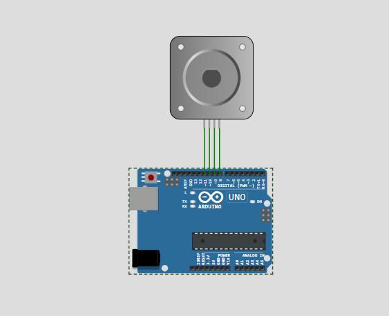

# Actividad 2. Sistema de control y actuación en función del clima.
## Adrián Antolín Pellicer, Pablo Nicolás Cristóbal Navas, Ahinoa Santamaría Puras
### Equipos e Instrumentación Electrónica, UNIR. Grupo 6

# Introducción


# Ejemplo 1
No ha sido posible implementar este ejemplo debido a que no disponíamos de los componentes necesarios en wokwi.

# Ejemplo 2
[wkowi](https://wokwi.com/projects/432313638470879233) COMPROBAR SI ES ESTE LINK

# Ejemplo 3
[wokwi](https://wokwi.com/projects/432314677733555201) COMPROBAR SI ES ESTE LINK

# Ejemplo 4
[wokwi](https://wokwi.com/projects/431938639801559041)

# Ejemplo 5
[wokwi](https://wokwi.com/projects/432310955268316161)

# Ejemplo 6
[wokwi](https://wokwi.com/projects/432136645298838529)

# Sistema final de control y actuación en función del clima.

Para nuestro [sistema final](https://wokwi.com/projects/432309953936838657), vamos a tener algunos de los sensores de la actividad 1. Son los siguientes:
- DHT22: mide temperatura y humedad.
- LDR: mide la luminosidad.
- MQ2 gas sensor: mide la calidad del aire
- MPU6050: usaremos únicamente el giroscopio, para controlar la rotación de la boya y aportar mediciones que podrían ser de utilidad para algún estudio relacionado con las mareas.

A mayores tenemos un potenciómetro que sirve para variar la luminosidad de la pantalla LCD y hemos definido en código que se actualicen los resultados cada dos minutos realizando un promedio.
```
// Calcular promedio cada 8 lecturas
  static unsigned long lastAverageTime = 0;
  // en loop()
  if (millis() - lastDHTRead >= DHT_INTERVAL) {
    lastDHTRead = millis();

    tempDHT = dht.readTemperature();

    if (!isnan(tempDHT)) {
      dhtTemps[dhtIndex] = tempDHT;
      dhtIndex = (dhtIndex + 1) % 8;

      if (dhtCount < 8) { //va hasta 8 porque si hay mediciones cada 15 segundos, hasta 2 minutos hay 8 mediciones
        dhtCount++;
      }

      // Calcular promedio cada 8 lecturas (2 minutos)
      if (dhtCount == 8) {
        float sum = 0;
        for (int i = 0; i < 8; i++) {
          sum += dhtTemps[i];
        }
        float promedio = sum / 8;

        //... muestra por pantalla
      }
    }
  } 
```

Hemos añadido diferentes actuadores en función de las lecturas de los sensores:
- Servomotor: cuando la temperatura medida es mayor a 30ºC, se pone en funcionamiento. La idea sería que se moviera 180º para abrirse y así dejar pasar agua al interior, de forma que se refrigerase el sistema.
- Relé: cuando la temperatura medida es menor a 15ºC, se activa dejando pasar corriente. Esta corriente iría hacia una resistencia de forma que aportaría calor al sistema y nos ayudaría a mantener una temperatura estable.
- LEDs: es un indicativo de la ubicación de la boya. Se activa cuando detectamos un porcentaje de luminosidad inferior al 50% se enciende un LED y si es menor que el 25% se encienden los 2.
